Ubuntu系统下用Android Studio进行cocos2d-x 3.13 开发
===
----

### 1.搭建Andoird Studio 开发环境
1. 从[官网](http://www.oracle.com/technetwork/java/javase/downloads/jdk8-downloads-2133151.html)选择最新的JDK版本(当前是jdk-8u101-linux-x64.tar.gz).
2. 下载好解压到/home/[username]/apps文件夹中,并重命名为jdk.
    ==图1-1==
    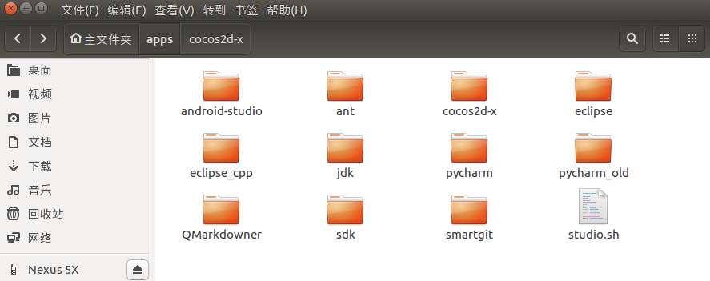
3. 配置JDK目录到用户的环境变量中
	(1)在终端输入命令
	```
	 gedit ~/.bashrc
	```
    (2)在打开的文本编辑器中末尾加入,并保存退出
    ```
    export JAVA_HOME=/home/[username]/apps/jdk
    export JRE_HOME=${JAVA_HOME}/jre
    export CLASSPATH=.:${JAVA_HOME}/lib:${JRE_HOME}/lib
    export PATH=${JAVA_HOME}/bin:$PATH
    ```
    (3)在终端输入命令
    ```
    source ~/.bashrc
    java -version
    ```
    如果返回了如下的信息,则表示配置成功了
    ```
    java version "1.8.0_91"
    Java(TM) SE Runtime Environment (build 1.8.0_91-b14)
    Java HotSpot(TM) 64-Bit Server VM (build 25.91-b14, mixed mode)
    ```
4. 科学上网后,从[Android官网](https://developer.android.com/studio/index.html)下载最新版的Android Studio开发工具,最新版为[android-sdk_r24.4.1-linux.tgz](https://dl.google.com/android/android-sdk_r24.4.1-linux.tgz)
    ==图1-2==
    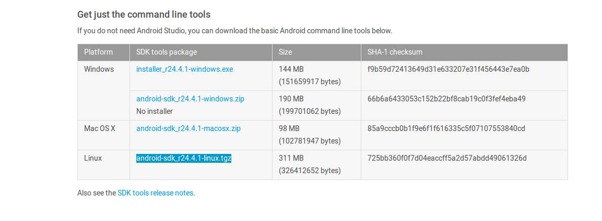
5. 下载好解压到/home/[username]/apps文件夹中(同图1-1)
6. 打开终端输入命令,进入android studio的运行目录,并启动Android Studio
    ```
    cd ~/apps/android-studio/bin
    ./studio.sh
    ```
7. 联机下载SDK和Graddle等工具之后进入主界面
	==图1-3==
	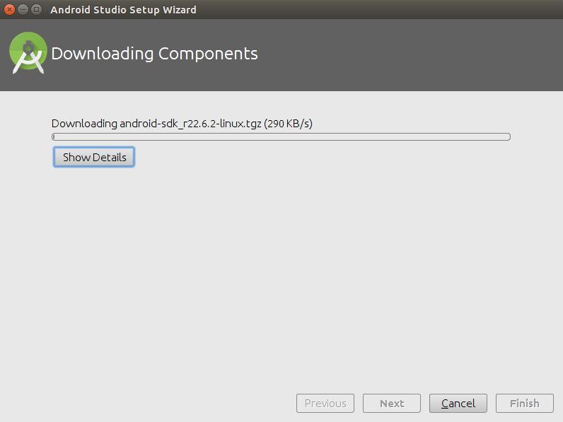
    ==图1-4==
	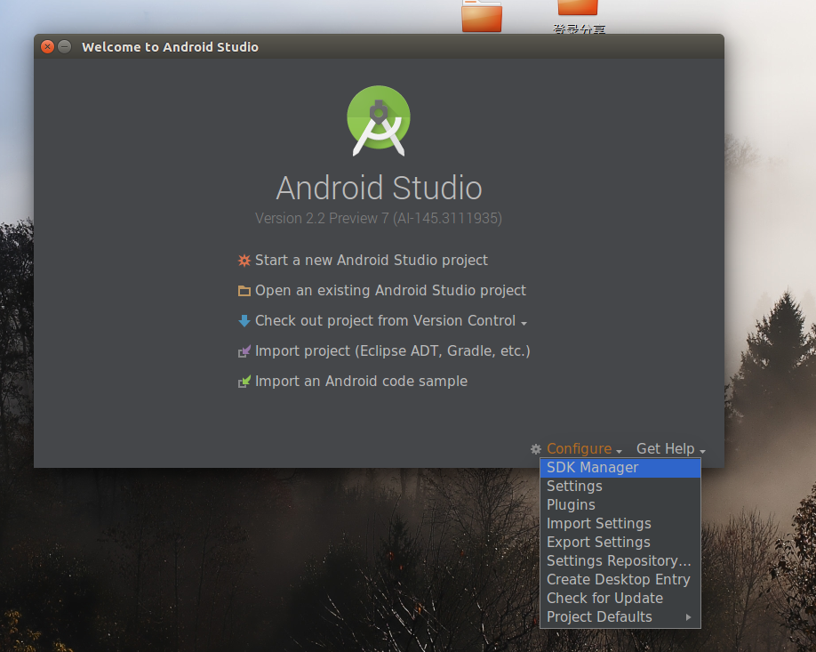
8. 如果想创建快捷方式,请在图1-4界面选择[Configure]-[Create Desktop Entry]即可.
9. 新建并打开一个Android Studio项目
10. 打开SDK Manager界面(点击下载箭头Android小人的那个,?图标旁边.也可已选择File-Setting打开,选中Android SDK),选中NDK按钮,点击OK,进行NDK安装.
	==图1-5==
	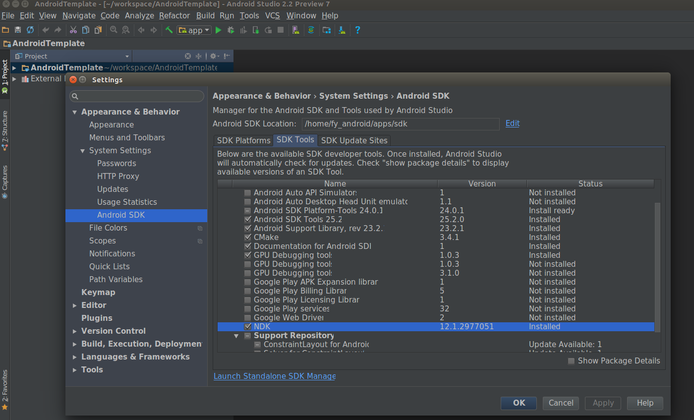
11. 安装完成后,点击Project Structure按钮(刚才那个问号图标左边第二个.也可以选择File-Project Structure),记住SDK和NDK目录.(我使用了Google推荐内置的JDK,可以修改为你已经配置好的Sun JDK),这个将在安装Cocos 2d-x环境需要用到.
	==图1-6==
	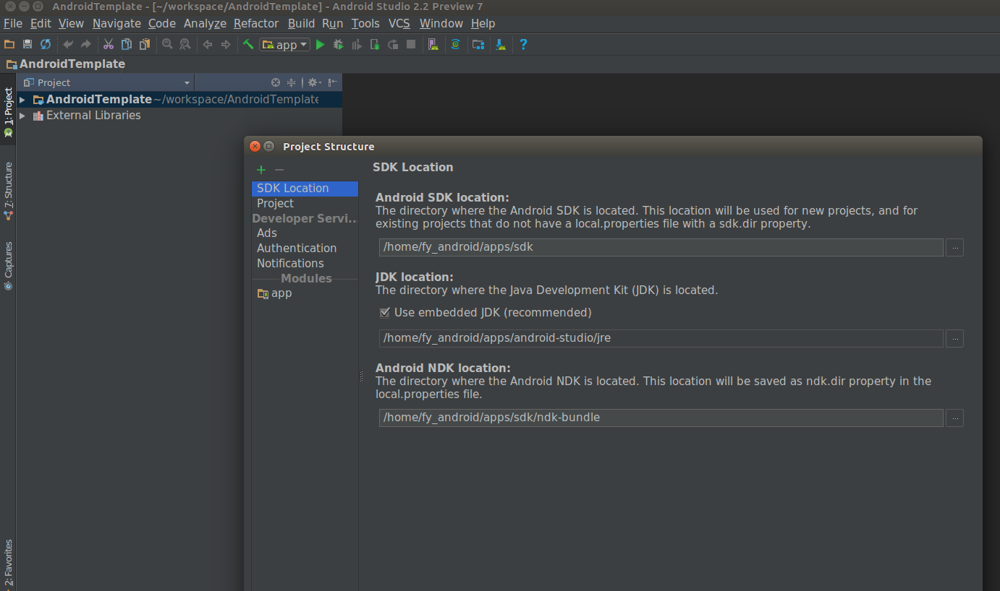
### 2.下载ANT编译工具并配置到环境变量中
1. 从[官网](http://ant.apache.org/bindownload.cgi)选择apache-ant-1.9.7-bin.tar.gz包进行下载
	==图2-1==
    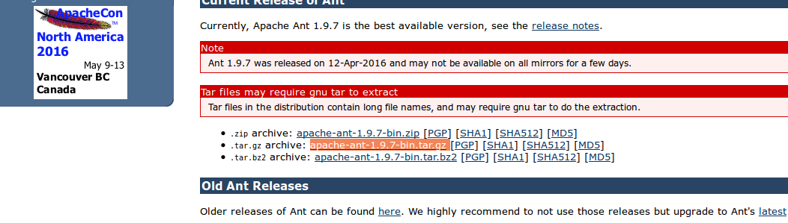
2. 下载完成后解压到/home/[username]/apps文件夹中,并重命名为cocos-2dx.(同图1-1)
3. 配置ANT目录到用户的环境变量中
(1)在终端输入命令
	```
	 gedit ~/.bashrc
	```
    (2)在打开的文本编辑器中末尾加入,并保存退出
    ```
    export ANT_ROOT=/home/[username]/apps/ant
    export PATH=$ANT_ROOT/bin:$PATH
    ```
    (3)在终端输入命令
    ```
    source ~/.bashrc
    ant -version
    ```
    如果返回了如下的信息,则表示配置成功了
    ```
    Apache Ant(TM) version 1.9.7 compiled on April 9 2016
    ```

### 3.下载cocos2d-x 3.13版本,并解压
1. 从[官网](http://www.cocos.com/download/#)选中cocos2d-x项目.
	==图3-1==
	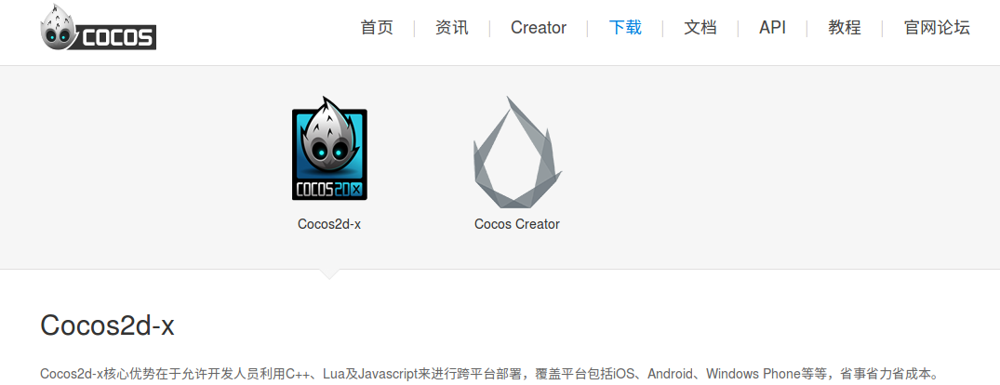
2. 在右下角点击[立即下载](http://www.cocos2d-x.org/filedown/cocos2d-x-3.13.zip)按钮,开始下载cocos2d-x文件.
	==图3-2==
    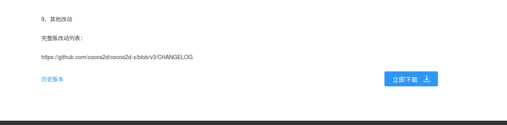
3. 下载完成后解压到/home/[username]/apps文件夹中,并重命名为cocos-2dx.(同图1-1)

### 4.运行steup.py文件进行环境配置
1. 进入cocs-2dx文件夹中,运行setup.py文件
	==图4-1==
    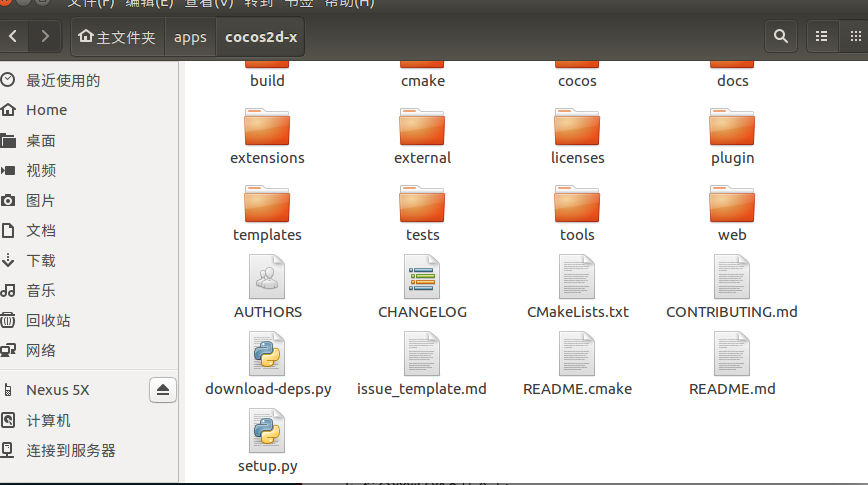
    打开终端输入以下命令
    ```
    cd ~/apps/cocos2d-x
	python setup.py
    ```
2. 输入SDK,NDK安装目录(如果之前没有配ANT变量会要求你输入ANT安装目录),界面如下
	==图4-2==
    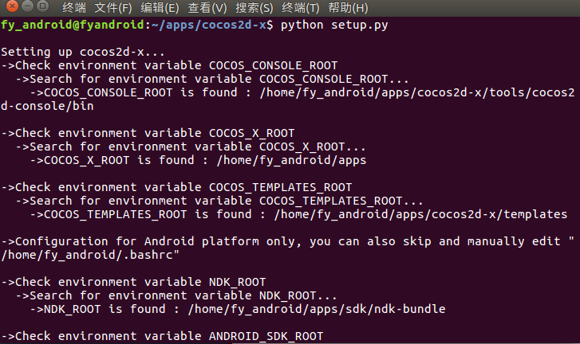
3. 完成配置后,在终端输入 `source ~/.bashrc` 刷新下环境变量
4. 在终端输入以下命令,检验cocos开发环境是否已经配好
	```
    cocos -v
    ```
    如果返回了如下的信息,则表示配置成功了
    ```
    cocos2d-x-3.13
    Cocos Console 2.1
    ```

### 5.配置Linux平台的Cocos2dx环境(如果不需要在Linux平台下运行,此步可以跳过)
1. 进入cocos2d-x的安装目录,安装Linux环境下的依赖,可以在终端输入命令
	```
    cd ~/apps/cocos2d-x/build
    ./install-deps-linux.sh
    ```
    安装完成之后会出现如下信息
    ==图5-1==
    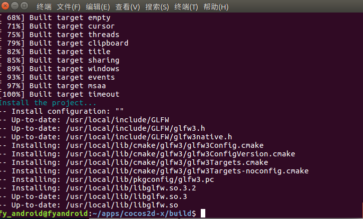


### 6.生成自己的cocos2dx工程
1. 切换到工作目录,比如 `~/workspace/cocosDemo`
	在终端输入
    ```
    cd ~/workspace/cocosDemo
    ```
     ==图6-1==
    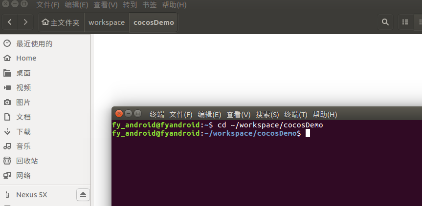
2. 新建一个cocos2dx工程,打开终端,输入如下命令
	```
    cocos new cocosdemo -p com.learning.cocosdemo -l cpp
    ```
    命令中 new 表示新建一个cocos2dx工程,后面表示工程名; -p 后面代表的是应用包名; -l 代表用的语言 这里我用的是c++.
    成功后出现如下界面,在cocosDemo工作目录中,出现了刚才新建的cocosDemo工程
	 ==图6-2==
    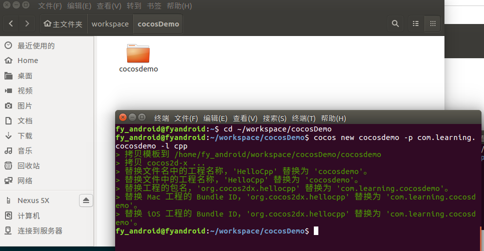
3. 现在我们先来运行下Linux平台下的Cocos2dx的Demo吧,在终端输入以下命令
    ```
    cd cocosdemo/
    cocos run -p linux
    ```
     ==图6-3==
    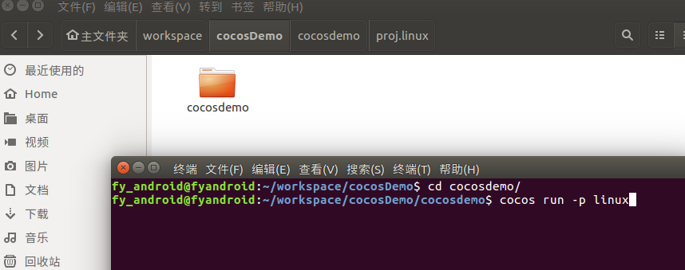
4. 编译完成后出现了游戏画面.编译后的生成运行文件在工程目录下/bin/debug/linux目录
	 ==图6-4==
    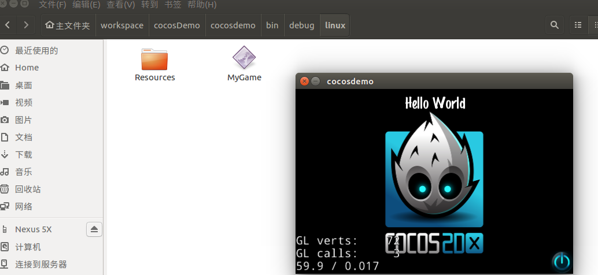

### 7.编译运行该工程的Android Studio 版本
1. 现在来运行Andorid Studio版本,这个跟Linux版本类似,插上Android真机,或者配置好虚拟机,然后在终端输入以下内容
	```
    cocos run -p android --android studio
    ```
    完成后,真机上已经出现了熟悉的画面.
     ==图6-5==
    